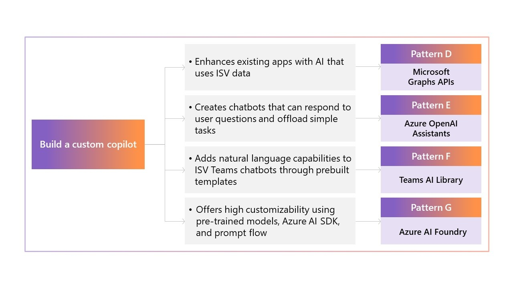

# Choosing the best pro-code pattern to create your generative AI solution

## Pattern selection in the pro-code ISV Journey

To help independent software vendors (ISVs) build their generative AI solutions, Microsoft created guidance to help you find a viable use case and start creating it. This page focuses on pro-code patterns developers can choose as they go through the journey of building their solution. If you're unsure whether to choose a pro-code or low-code pattern, visit the [capability envisioning page](Capability-Envisioning.md) to find the best approach for your use case.

## Considerations for a pro-code journey

Choosing a pro-code approach enables ISVs like you to make use of highly customizable options when designing your AI applications. Within the pro-code approach, there are many patterns covering several platforms to address different needs and preferences. A pro-code pattern is a good fit if you are:

- Building a highly customized app and need more components within your control.
- Integrating AI capabilities into your own application or building one from scratch.
- Adhering to unique data or security concerns.

If you need a quick solution and can use tools like Power Platform connectors, consider researching [low-code patterns](Low-Code-Patterns.md).

There are two high-level approaches within pro-code:

- **Building a custom copilot.** This approach encompasses patterns that help you to create a solution with natural language capabilities. Building with a custom copilot enables your AI to converse naturally with users in a wide range of situations.
- **Building an application on Fabric.** This approach covers patterns that use Fabric to process or store data, which can be integrated with an AI application you create. These patterns provide a strong data foundation and an opportunity for more customization.

Both approaches offer numerous benefits and enable you to create a customizable AI application. Depending on the pattern you choose, you may build an entirely new application or new capabilities that you introduce into an existing application.

## Choosing a pattern

Choosing a pattern is the last step an ISV takes before beginning to build a solution.
The pattern you select:

- **Impacts the capabilities of your solution.** Choosing the correct pattern for the situation enables you to align your solution to your customers' needs. Selecting a pattern with too few capabilities can limit what you can create.
- **Affects the developmental cost of the project.** Some patterns require a heavier lift during development, costing ISVs time and money. The investment needed for the pattern you select shouldn't outpace the potential value of your use case.
- **Enables you to work within different interfaces.** Some patterns are designed to create applications from scratch, while others are designed to work within your existing applications or platforms from Microsoft.
- **Changes data, infrastructure, and other back-end considerations.** Pro-code patterns are versatile but may have limits or require modifications. Typically, your data and infrastructure options become more customizable as you choose more complex pattern options.

Because of all these factors, it is essential to carefully evaluate your situation, your customers' needs, and your technical capabilities before choosing a pattern. The platform and strategy you select will impact what you can create.

## Multiple pattern options

Instead of choosing just one pattern, ISVs may choose to integrate capabilities from multiple patterns. It's even possible to combine low-code and pro-code options.

Whether you choose one pattern or combine multiple, it's important to consider the situation you are in and choose the platform that works best for you. This page focuses specifically on pro-code patterns. To explore more options across pro- and low-code, you can visit the [comprehensive patterns page](/microsoft-cloud/dev/copilot/isv-extensibility-story).

### Semantic Kernel

ISVs looking to build sophisticated AI applications can use [Semantic Kernel](https://github.com/microsoft/semantic-kernel) in many of the different pattern options. Semantic Kernel is an open-source software development kit (SDK) that makes it easy to combine your existing C#, Python, and Java code with models from OpenAI, Azure OpenAI, Hugging Face, and more.

Because Semantic Kernel interacts directly with your code, it is possible to use it many different patterns. Regardless of the pattern you choose, Semantic Kernel can support your development journey and enabling your solution with new generative AI capabilities.

## Build a custom copilot

Building a custom copilot enables you to create an application with a moderate coding lift and more customizability than adopting or extending a first-party, Microsoft Copilot would. While you need to build many components on your own, Microsoft provides notable support through SDKs, templates, and more, depending on the pattern you choose.

A decision tree for the "Build a custom copilot" approach. One arrow leads into a box reading "Enhances existing apps with AI that uses ISV data", which connects with Pattern D: Microsoft Graph APIs. Another arrow leads into a box reading "Creates chatbots that can respond to user questions and offload simple tasks", which leads into Pattern E: Azure OpenAI Assistants. A third arrow leads into a box that says "Adds natural language capabilities to ISV Teams chatbots through prebuilt templates", which leads to Pattern F: Teams AI Library. A final arrow leads to a box reading "Offers high customizability using pre-trained models, Azure AI SDK, and prompt flow", which leads to 

### Microsoft Graph APIs

The Microsoft Graph API accesses user data from Microsoft 365 applications, such as information within Outlook, Teams, OneDrive, and SharePoint. By enabling your existing applications to call this API, you can enhance your user experience with personalized data from Microsoft 365. 

These APIs can be integrated within your own solution's UI. The tenant data collected can be viewed from [Graph Explorer](/graph/graph-explorer/graph-explorer-overview), which is an open-source platform designed to help you learn about Microsoft Graph APIs.

You might be interested in this pattern if you:

- Have an existing application you want to enhance with personalized data.
- Want to provide personalized responses to your end user based on their Microsoft 365 activity.
- Require data specifically from Microsoft 365.

The key benefits of this approach include:

- Accessing your end user's Microsoft 365 data to personalize their experience.
- Connecting to data quickly and easily, enabling you to focus on other aspects of your application.

Let's examine how one fictional ISV was able to use this pattern in their application.

#### Microsoft Graph APIs scenario

Contoso has built an application that enables its customers to manage internal operations, but they are seeking to improve it. Their customers bring forward issues about basic administrative tasks-such as scheduling meetings, logging time off, and sending emails-taking too much time.

To address this issue, Contoso decides to augment their generative AI application using Microsoft Graph APIs, which can connect to their customers' data in Microsoft 365. Contoso is able to enhance the capabilities of their AI assistant with access to more relevant personal data retrieved from the API. Microsoft Graph APIs enable Contoso's solution to:

- Generate calendar entries and time away emails based on context from the user and their time off requests.
- Use information from their end customers' Outlook calendars to suggest potential meeting times and invitees.
- Suggest tone edits, subject lines, and documents to attach to emails based on history between recipient and sender.

These changes and more enable Contoso's generative AI application to dramatically streamline their customers' administrative tasks. By using Microsoft Graph APIs in their application, they could provide useful and personalized advice for employees.

### Azure OpenAI Assistants

Using the capabilities of [Azure OpenAI Assistants](/azure/ai-services/openai/assistants-quickstart), ISVs can quickly create AI assistants and integrate them into their existing applications. Azure OpenAI Assistants can answer questions, prompt simple tasks, and even be adapted to write and execute code based on a user's inputs.

Creating an Azure OpenAI Assistant is as simple as writing a JSON file describing the function you would like the assistant to perform and giving it a sandboxed Python environment in which to run. This enables the assistant to call your existing APIs and begin responding to prompts.

You might be interested in this pattern if you:

- Have an existing application that would benefit from a customized assistant.
- Want to develop a copilot-like application quickly with less technical lift.
- Need to integrate with additional tools that enable your application to complete tasks without language, such as math.

The key benefits of this approach include:

- Creating an AI assistant quickly and efficiently.
- Providing your customers with an AI assistant capable of answering more specific questions and requests.
- Enabling your solution with AI capabilities that can prompt simple actions to streamline tasks.

#### Azure OpenAI assistant scenario

Contoso has an existing application for retail customers that provides an employee portal for onboarding, inventory management, payment processing, and more. Contoso will use Azure OpenAI Assistant to create a store assistant, providing customers with guidance tailored to their specific situation.

By creating an AI assistant, Contoso can integrate the businesses' data into the application, which allows it to answer questions using company data. These capabilities allow the copilot to:

- Guide new employees through typical store processes.
- Predict inventory needs and requirements based on past trends.
- Reference guidance in uploaded employment documents, such as leave policies.

By including an AI assistant within their application, Contoso's solution becomes a source of guidance and suggestions for employees, rather than just a management tool. Their customers can use it to answer questions and identify a path forward in day-to-day tasks.

### Teams AI library

If you already have a Teams chatbot or are interested in creating one, your chatbot can be enhanced with generative AI capabilities. Scaffolding within [Teams AI library](/microsoftteams/platform/bots/what-are-bots) is able to support conversational language for your chatbot, which can be accessed directly by users in Teams.

This application requires you to input the business logic you would like your app to use while the large language models (LLMs) that Microsoft provides handle the back-end aspects of the chatbot. You can even modify your chatbot to use different LLMs, plugins, and more.

You might be interested in this pattern if you:

- Have an existing Teams chatbot that you would like to augment with natural language capabilities.
- Want to leverage pre-built templates, integrated data options, and built-in safety features.

The key benefits of this approach include:

- Improving your Teams chatbot with natural-language capabilities.
- Building a generative AI solution with ample support options.
- Customizing your chatbot to apply to your situational or industrial needs.

#### Teams AI library scenario

Contoso has made Teams chatbots available to their customers for some time now, but as AI capabilities evolve, they want to modernize their application by enabling it to answer more specific questions and provide personalized advice to the employee.

Using the Microsoft Teams AI library, Contoso can easily add natural language capabilities to their chatbot. These new generative AI capabilities enable the chatbot to better support customers by:

- Suggesting tactical next steps for ongoing projects and tips to prepare for upcoming company events.
- Creating meeting agendas, email drafts, and more based on a short interaction between the user and chatbot.
- Answering questions using tailored responses based on the context of the conversation.

These features help streamline the employee experience for Contoso's customers and enables them to get more intelligent answers, faster. Incorporating generative AI into their Teams chatbot makes its users more efficient at work, as they can naturally converse with the chatbot to receive support at work.

### Azure AI Studio

If you want to create a completely customized generative AI application that is highly flexible in terms of capabilities, you can use one of the many cutting-edge options from [Azure AI Studio](/azure/ai-studio/what-is-ai-studio). Building generative AI solutions with Azure AI Studio enables you to customize your solution to your specific needs, including meeting highly technical or niche requirements.

Azure AI Studio includes many options to build an AI application, such as prompt flow and the Azure AI SDK, both of which have pretrained models from which you can build. The service is integrated with other Azure services and provides resources for ongoing application development, such as an LLMOps toolchain.

You might be interested in this pattern if you:

- Want to build an application from scratch or modify an existing one.
- Require your AI assistant to complete complex processes, such as reading and reviewing technical documents or analyzing complex data trends.
- Want full control over app development to customize voice, personality, and brand identity to your specific needs.

The key benefits of this approach include:

- Creating a bespoke copilot that can respond to more niche questions and requests.
- Customizing your solution to adhere to unique security or data requirements.

#### Azure AI Studio scenario

Contoso wants to build a fully customized generative AI application to support their healthcare customers during claims creation and processing. To commercialize the application, they needed to be able to accurately process customer information, meet specialized security considerations, and generate accurate content.

By using Azure AI Studio to create their own generative AI application from scratch, they were able to build a fully customized, highly secure application tailored to the needs of their healthcare customers. Contoso's new application enables clinicians working for insurers to easily fill out forms. The copilot they created through Azure AI Studio can:

- Support building conditional authorization forms through conversational prompting based on a variety of organization-specific questions.
- Query multiple patient records and review information within Contoso's application.
- Meet organization-specific security considerations to minimize risk and privacy concerns.

By accurately retrieving patient information and using natural language capabilities to assist in generating forms, Contoso can accelerate the claims creation process. Their solution saves users valuable time by completing these specialized tasks quickly and accurately.

## Build an app on Fabric

While many ISVs are familiar with Fabric as a data or analytics solution, it can also serve as a comprehensive, integrated data foundation for generative AI applications. Whether you want to build an app directly on Fabric or integrate with OneLake, [building an app on Fabric](/fabric/cicd/partners/partner-integration) provides you with unmatched customization and control over your solution.

A link tree for the "build an app on Fabric" approach. One arrow leads to a box reading "Allows ISVs to read, write and manage data within Fabric OneLake using existing APIs, shortcuts, and more", which leads to Pattern H: Interop with Fabric. A second arrow leads to a box reading "Enables ISVs to develop products on top of the Fabric platform or combine Fabric with pre-existing applications", which leads to Pattern I: Build on Fabric. A final arrow leads to a box reading "provides ISVs with tools to create highly customizable workloads within the Fabric ecosystem", which leads to Pattern J: Build a Fabric workload.

:::image type="content" source="media/2_Procode_patterns_graphic.jpg" alt-text="A link tree for the build an app on Fabric approach" border="false" :::

### Interop with Fabric

Integrating your existing application with Fabric provides endless options for streamlining the data backend of your solution. By interoperating with Fabric, you can unify a multitude of disparate data sources on a single platform using a variety of tools and APIs.

Fabric offers both OneLake APIs and Real-Time Intelligence APIs that are designed to quickly access and process your data. You can also use Data Factory to unify your data across environments through shortcuts and manage complex data processing tasks from up to 200 external sources. Even if your data isn't on Azure, you can create shortcuts to bring your data into OneLake.

You might be interested in this pattern if you:

- Have an existing application that requires enhanced data processing.
- Are drawing your data from a variety of sources and environments.
- Want to read and manage your application's data within OneLake or Data Factory.

The key benefits of this approach include:

- Improving data capabilities for existing apps through increased processing, storage, and analytic abilities.
- Integrating data from multiple tenants and environments into one platform.

#### Interop with Fabric scenario

The SaaS application that Contoso has developed for their retail customers requires greater data capabilities to manage data from multiple tenants. Contoso's end customers require greater visibility into their data and are requesting more information about trends and patterns within their data. However, their customers use a variety of platforms for inventory management, staffing, web management, and more that Contoso needs to access to form a complete view of the data.

To address these issues, Contoso connected their existing application to Fabric. This allows them to have better data management at an administrative level, as well as better data insights and visibility for tenants. Their application is able to:

- Use data sharing and multicloud shortcuts to gather information from different tenants in OneLake.
- Access organization data immediately through Real-Time Intelligence APIs.
- Handle amounts of data associated with a large-scale solution.
- Portray information about customer's data to them through interactive dashboards that Contoso created in their application.

Now that Contoso can access data from their customers more easily, they are able to modify their solution to provide that information to their end customers. Their end customers can easily and accurately interpret their data and use it to make choices for their business.

### Build on Fabric

Beyond connecting to Fabric as a data platform for your application, you can also build on Fabric to embed Fabric's functionalities directly into your app. Developers can use a variety of REST APIs to build Fabric capabilities into their applications to support more technical workflows with generative AI capabilities.

Different APIs can be integrated within your application to enable it with different functions. For instance, embedding the Warehouse API within your application provides it with the Data Warehouse options available within Fabric. Developing your application directly on top of Fabric allows you to seamlessly utilize and manipulate these Fabric functions within your own application's interface.

You might be interested in this pattern if you:

- Are building an application that will be used by data scientists or other users with more comprehensive data management needs.
- Want to incorporate comprehensive data storage and processing options in your application.
- Are looking to build an application from scratch or modify an existing one.

The key benefits of this approach include:

- Integrating Fabric's data capabilities directly into your solution.
- Managing and manipulating data within your own application.
- Creating your application with full customizability and control.

#### Build on Fabric scenario

Contoso's customers have been expressing a need for more complex data capabilities. Between tracking sales trends, employee schedules, inventory for digital and in-person stores, and more across multiple tenants, they require much more data processing support in their new application.

To more effectively manage customer data, Contoso developed a new application built on top of Fabric. This application allows users to interface directly with their data and interact with it in Contoso's application. By harnessing Fabric's data processing capabilities, their application can:

- Connect to OneLake, Power BI, and more directly within the application, which can be surfaced through customized dashboards built by Contoso.
- Provide data insights into profitability from categories such as online or in-person stores, different store locations, and by product brand and category.
- Use AI to analyze this data and provide insights and suggestions to customers, such as suggesting a change in pricing for a product, predicting potential disruptions, and identifying outliers in revenue streams.
- Provide Contoso's customers direct access to their Fabric data within Contoso's platform.

By embedding Fabric's capabilities within their application, they can manage and manipulate data directly within their solution. The AI they've built on top of their solution is able to access this data and provide personalized business insights for Contoso's customers.

### Build a Fabric workload

In addition to building with Fabric's seven native workloads, ISVs can expand Fabric's capabilities by creating their own customized workloads and offering them as a separate solution. These workloads can be built from scratch to deliver a plethora of data management capabilities, whether that's creating a more holistic view of your customers' data or taking actions based on data trends and predictions.

ISVs can use the [Microsoft Fabric Workload Development Kit](/fabric/workload-development-kit/development-kit-overview) to create their own workload and publish it as a SaaS offering for other Fabric users on the Azure Marketplace. This pattern is easily monetizable on Azure Marketplace and uses Fabric UX when interfacing with customers, which leaves you free to focus on developing your workload.

You might be interested in this pattern if you:

- Would like to create a tool available to end-users on Fabric, such as other developers or data scientists.
- See a data need or requirement that you want to address with Fabric.
- Want to leverage Microsoft support like existing UX and simple publication on Azure Marketplace.

The key benefits of this approach include:

- Publishing your application in Azure Marketplace, where it can be easily accessed and purchased by technical end users in Fabric.
- Creating highly customizable solutions directly tailored to your customers' data requirements.

#### Build a Fabric workload scenario

Contoso wants to create solutions that can be used by their retail customers to track supply chains and inventory management across both digital and in-person stores for several tenants. They want their application to be easily accessible for technical end users so that they can pursue more use for their data-driven application.

Using the Microsoft Fabric Workload Development Kit, Contoso was able to develop a workload their customers can access directly from Fabric in a UX they are familiar with. They were able to monetize it as a SaaS application in Azure Marketplace, where it is easily accessible to Contoso's end users in the Fabric platform. Their Fabric workload is able to:

- Optimize inventory by providing insight into areas that need additional demand and using AI capabilities to suggest a path forward.
- Forecast future demand through machine learning capabilities that analyze past trends.
- Simulate possible scenarios that could affect the supply chain, such as changing suppliers.

By offering their solution as a Fabric workload, Contoso can help data scientists and other technical professionals optimize supply chains. Contoso's customers gain greater visibility into their business, through the AI's careful analysis of past data and predictions of future trends.

## Conclusion

By learning about each pattern and their capabilities, you should now be equipped to decide how to build your generative AI solution. After researching your chosen approach and confirming that it is within your capabilities, you can begin developing your application.

Explore the resources below to learn more about your chosen pattern as well as other next steps to building your generative AI experience. 

### Build your own copilot

Links to more information for each build your own copilot pattern:

- [Pattern D - Microsoft Graph APIs](/graph/graph-explorer/graph-explorer-overview)
- [Pattern E - Azure OpenAI Assistants](/azure/ai-services/openai/assistants-quickstart)
- [Pattern F - Teams AI Library](/microsoftteams/platform/messaging-extensions/build-bot-based-message-extension)
- [Pattern G - Azure AI Studio](/azure/ai-studio/what-is-ai-studio)

### More information about building an app on Fabric

Links to more information about building apps on Fabric:

- [Approach - Build an app on Fabric](/fabric/cicd/partners/partner-integration)
- [Pattern J - Build a workload on Fabric](/fabric/workload-development-kit/development-kit-overview)

## Related links

More information on generative AI patterns and their benefits: [Creating Generative AI Experiences with the Microsoft Cloud - A Guide for ISVs | Microsoft Learn](isv-extensibility-story.md)

UX guidance for ISVs designing generative AI experiences: [Next steps for designing your generative AI user experience.](UX-Guidance.md)
